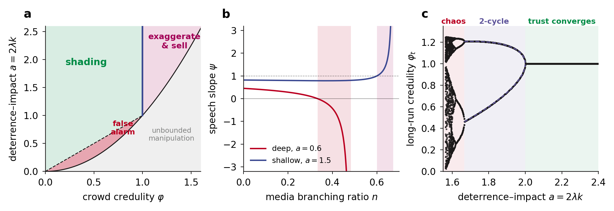
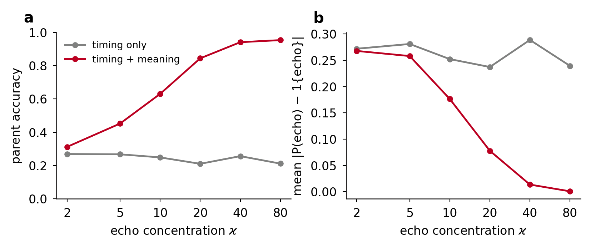

# Say, Echo, Do

**Strategic Narratives and Revealed Positioning in Financial Markets**: the paper, plus a tested Python toolkit for inverting institutional and media sentiment.

> **Status: first draft (v0.1, September 2026).** The theory, code and controlled experiments are complete; a study on market data is future work. Comments and corrections are welcome: open an issue or email aliatiah100@gmail.com.

Markets hear three voices:

| Voice | What it is | Where you observe it |
|---|---|---|
| **Say** | what institutions publicly claim | ratings, research notes, management tone on earnings calls |
| **Echo** | what the media repeats and amplifies | article volume, syndication, social posts |
| **Do** | what capital actually does | insider trades, holdings, futures positioning, options flow, price |

Most sentiment models listen only to the first two. This project models the **disagreement** between the three voices and turns it into signals whose signs are fixed by theorems:

* **Deeds over words.** When the observable covariance between what institutions say and what they do is negative, their words should be faded. Deeds are always followed.
* **Fade the echo, follow the news.** Repetition carries no information, so its price effect unwinds. Genuinely new information that the crowd under-weights keeps moving the price.
* **Absorption.** If the story implied a 6% fall and the price fell 2%, someone absorbed the selling.
* **Who moved first.** The Lévy area between positioning and headline gloom shows whether money moved before the narrative turned.

The central theoretical result explains false alarms endogenously. An institution that trades while addressing a partly credulous crowd optimally talks an asset **down while buying it** exactly when `φ² < 2λk < φ` (credulity φ, price impact λ, misreporting cost k).

<p align="center"></p>

---

## The paper

**Main paper:** [`paper/pdf/say_echo_do_arxiv.pdf`](paper/pdf/say_echo_do_arxiv.pdf), source in `paper/arxiv/` (a single self-contained `.tex` file, ready for arXiv; submission-form text in `paper/arxiv/ARXIV_METADATA.md`).

The same results are also available in other formats:

| Edition | Folder | Use it for |
|---|---|---|
| arXiv preprint (main) | `paper/arxiv` | full theory, proofs, verification and controlled experiments, 37 pages |
| NeurIPS 2026 style | `paper/neurips` | 9-page conference-style version with proofs in the appendix (non-anonymous; `make neurips`); `paper/neurips/arxiv_upload.zip` is the arXiv upload bundle |
| dark edition | `paper/arxiv-dark` | the main paper on a black page with creamy-white text, for screens |
| journal | `paper/journal` | one-column, plain-language readings after each result |
| ICML 2026 | `paper/icml` | conference submission (blind review, official style) |
| conference | `paper/conference` | two-column, 9 pages |
| explainer / report | `paper/explainer`, `paper/report` | short concept explainer and earlier technical report |

Theorem numbers differ between editions; the code follows the main paper.

## Install

```bash
git clone <your-fork-url> say-echo-do
cd say-echo-do
pip install -e ".[dev]"        # numpy + scipy; dev adds pytest and matplotlib
pytest                         # 47 tests, about 6 seconds
```

Optional extras: `.[plots]` for matplotlib figures and `.[torch]` for differentiable embedding fine-tuning.

## Quick start

```python
import numpy as np
from say_echo_do import StrategicInstitution, manipulation_window, HawkesParams, semantic_declustering, levy_area

# 1. Is this market in the false-alarm regime?
inst = StrategicInstitution(phi=0.6, lam=0.5, k=0.5)      # a = 2*lam*k = 0.5
inst.regime()                  # Regime.FALSE_ALARM
inst.speech_slope, inst.trade_slope   # (-0.714, 1.429): talks down, buys

# 2. Which media echo shares make false alarms optimal?
manipulation_window(phi0=0.4, a=0.6)  # false alarm for 0.333 < n < 0.484

# 3. Separate news from echo using timing AND meaning
res = semantic_declustering(times, embeddings, HawkesParams(mu=0.8, alpha=2.4, beta=3.0), kappa=60)
res.p_news                     # posterior probability that each article is new information

# 4. Who moved first?
levy_area(positioning, gloom) > 0     # True -> money led the story
```

A complete synthetic episode, from coverage cascade to position size, runs in a few seconds:

```bash
python examples/false_alarm_walkthrough.py
```
```
echo share: estimated 0.77, actual 0.74
sentiment  news = -1.86   echo = -3.98
rolling Cov(Say, Do) = -0.0296  ->  FADE institutional words
implied reaction -5.7% (n_eff 92), actual -1.9%  ->  absorption A = +2.00
Levy area rate (buying, gloom) = +0.047  ->  money led
regime probabilities  informational 0.00  overreaction 0.01  strategic 0.99
composite score D = +6.81  ->  LEAN LONG, sized at 0.34 x full Kelly
```

## What is implemented

Theorem and section numbers refer to the main paper, `paper/arxiv` (PDF: `paper/pdf/say_echo_do_arxiv.pdf`).

| Module | Implements | Paper |
|---|---|---|
| `gaussian` | three-voice market: follow-or-fade loadings, fade-the-echo, Say–Do gap, absorption sign, simulator | §3: Thm 3.4, Cor 3.5–3.6, Thm 3.7–3.8, Lem 3.9 |
| `strategic` | optimal speech and trade, four-regime taxonomy, Say–Do covariance identity, virality windows, adaptive-trust map, 2-cycle, Lyapunov exponent | §4: Thm 4.3, Cor 4.4, Thm 4.5, Prop 4.6, Thm 4.7 |
| `echo` | exponential Hawkes simulation (cluster representation), MLE fit, vMF sampler, **semantic declustering**, news/echo sentiment split | §5: Prop 5.4, Thm 5.7 |
| `embeddings` | return-aligned soft-InfoNCE loss (NumPy and PyTorch), entropy bound, **neighbour certificate**, topic-orthogonal sentiment, χ²-calibrated surprise, analog ("déjà vu") forecasting, absorption | §6: Thm 6.1, Thm 6.3 (Pinsker and exact certificates), Prop 6.7, Prop 6.9 |
| `leadlag` | exact Lévy area of piecewise-linear paths, area rate, rolling area | §7: Thm 7.3 |
| `decisions` | causal HMM regime filter, detection bound, adaptive conformal intervals, Kelly shrinkage | §8–9: Prop 8.1, Thm 8.2–8.3, Thm 9.1 |
| `signal` | composite follow-or-fade score with theorem-fixed signs and the Say–Do switch | §10 |
| `simulation` | agent-based market with strategic institutions, Hawkes media cascades with semantic marks, crowd pricing and revealed positioning | §12 |
| `plotting` | AAAS/*Science* palette and figure style | — |

## Reproducing the paper

```bash
python scripts/reproduce_table1.py      # Table 1: theory vs simulation -> results/table1.{csv,md}
python scripts/make_figures.py          # quantitative figures -> figures/
cd paper && make                        # main paper (arXiv); or: journal, icml, conference, explainer, report, all
```

Table 1 of the paper (seed 0, 2×10⁶ draws; theory values are exact):

| Result | Quantity | Theory | Simulation |
|---|---|---:|---:|
| Corollary 3.5 | Bayes weight on echo | 0 | −0.0006 |
| Theorem 3.4 | return loading, echo channel | −0.1840 | −0.1843 |
| Theorem 3.7 | loading on positioning c_x | 0.4012 | 0.4004 |
| Theorem 3.8 | absorption coefficient c_A | −0.1997 | −0.2004 |
| Theorem 4.3 | speech slope ψ | −0.7143 | −0.7143 |
| Theorem 4.5 | Cov(r, Say), t₃ values, false alarm | −2.294 | −2.293 |
| Theorem 4.7 | 2-cycle point φ₊ at a = 1.95 | 1.131 | 1.131 |
| Theorem 5.7 | max \|posterior − product\| (exact enumeration) | 0 | 1.1×10⁻¹⁶ |
| Theorem 7.3 | Lévy area rate, lag 0.5 | 0.2356 | 0.2360 |
| Theorem 9.1 | growth at full Kelly | −0.0300 | −0.0300 |

The full table is in `results/table1.md`.

Section 11 of the paper also shows that semantic declustering helps in practice. On simulated cascades, adding embedding similarity raises parent-attribution accuracy from about 21% (timing only) to 95% at high echo concentration:

<p align="center"></p>

## Controlled experiments

Section 12 of the paper tests the tools in a simulated market where the truth is known (300 firms × 60 events, causal features, first half of events for training, second half for testing). To rerun everything (roughly an hour on two cores):

```bash
python experiments/run_simulation_experiments.py main         # 5 seeds + Say–Do switch window sweep
python experiments/run_simulation_experiments.py robustness   # reference + 7 variants × 3 seeds
python experiments/run_simulation_experiments.py samples      # 20 / 40 / 80 events per firm
python experiments/text_experiment.py                         # return-aligned embeddings (seed 0)
python experiments/text_experiment.py 1 && python experiments/text_experiment.py 2
python experiments/text_experiment.py 0 0 0.3                 # noise-free outcomes, sharp targets (certificate)
python experiments/summarize.py                               # -> results/sim/summary.{md,json}
python experiments/diagnostics.py                             # oracle IC, absorption decomposition -> results/sim/diagnostics.json
python scripts/check_certificate.py                           # Theorem 6.3 on 3,000 random cases
```

Headline results (main market, five seeds; full tables in `results/sim/summary.md`):

| Question | Result |
|---|---|
| Echo vs news | echo share estimated 0.422 (true 0.427); fading echo sentiment significant in 29/29 simulated markets (t ≈ −8); following news significant in 21/29 |
| Say–Do switch | rolling Say–Do correlation flags false-alarm events with AUC 0.895 (0.934 in a detector trained on true labels); fade/follow label correct 85–96% |
| Absorption | estimated absorption predicts reversal everywhere; the residual is mostly narrative misfit, and with the true absorption the coefficient is near zero (**not a test of the theorem**) |
| Lead–lag | right sign in 27/29 markets, significant in 9/29 (**weak**) |
| Forecasting | linear on raw voices IC 0.169; + theory features 0.171; unit-weight composite 0.049; oracle (true mispricing) 0.181, so little headroom |
| Text | return-aligned 16-d embedding: analog IC 0.892 vs 0.192 for TF-IDF; neighbours share consequence 100% vs 51% |
| Certificate | never wrong; certifies nothing with realistic outcome noise; exact form certifies 45% of comparisons with noise-free, sharp targets, where Pinsker certifies none |

## Using it on real data

The walkthrough marks where each simulated block would be replaced with real data.

1. **Echo.** Timestamps and sentence embeddings (any encoder) for articles about an asset. Fit `fit_hawkes`, then run `semantic_declustering` and `split_sentiment`.
2. **Say vs Do.** Pair like with like. Management tone goes with insider trades (both public), and house views go with disclosed holdings or futures positioning. Track `say_do_switch(say, do, window)`.
3. **Absorption.** Build a point-in-time library of past events with their abnormal returns, then call `analog_forecast` on the new story and standardise the gap.
4. **Timing.** `rolling_levy_area(positioning, gloom, window)`.
5. **Decide.** Combine the signals into `EventSignals`, filter regimes with `RegimeFilter`, size with `kelly_shrinkage`, and calibrate with `AdaptiveConformal`.

Use only data that was public at each decision time. Retrain every learned component on rolling windows. Evaluate with purged, combinatorial cross-validation and deflated performance statistics before trusting any backtest. Pretrained language models can leak future information, so report results after their training cutoff.

## Repository layout

```
src/say_echo_do/     the package
tests/               pytest suite (every theorem checked independently)
scripts/             reproduce Table 1 and figures
experiments/         controlled experiments of Section 12 (simulated market, text experiment, summary)
examples/            end-to-end walkthrough
paper/               main paper (arxiv/) plus journal, ICML 2026, conference, explainer and report editions (+ PDFs)
figures/, results/   generated outputs
```

## Scope and responsible use

This is a theory and tooling project. **No backtest on market data is reported**; the experiments are simulated. A "strategic" reading means only that narrative and capital moved in opposite directions in a particular order. It is not evidence that any party lied, and firms maintain information barriers between research and trading. The toolkit is meant for detection, research and investor protection. Creating or spreading narratives intended to move prices is market manipulation. Nothing here is investment advice.

## Citation

See `CITATION.cff`.

## License

MIT, see `LICENSE`. The ICML and NeurIPS style files in `paper/icml/` and `paper/neurips/` are distributed under their own terms by those conferences.
